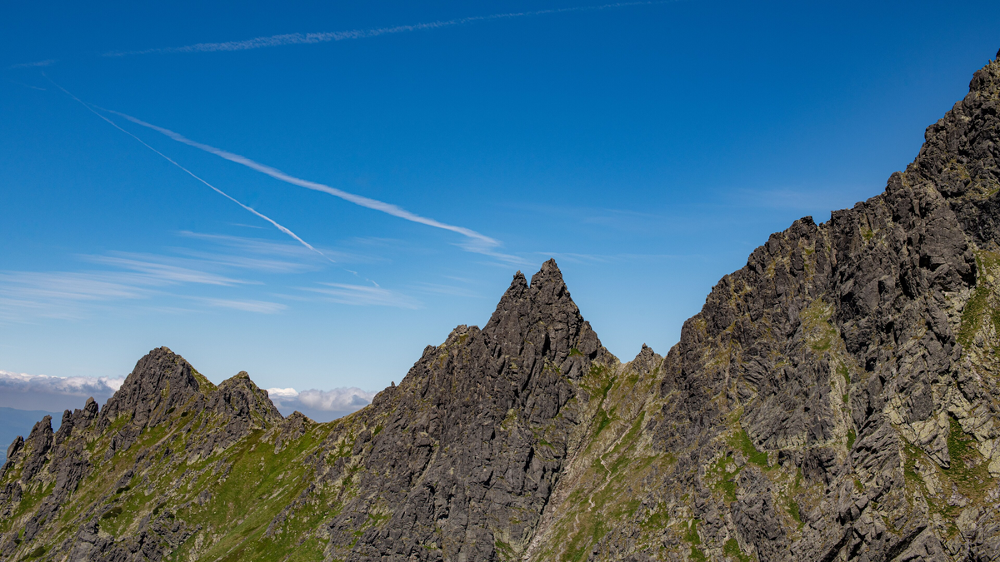

# Cupertino

An Apple Human Interface Guidelines-inspired dark theme for [Omarchy](https://omarchy.org). System-blue accents, Apple's dark-mode gray scale, and a curated set of high-resolution nature wallpapers in the macOS style.



## Install

```sh
omarchy theme install https://github.com/dreed47/omarchy-cupertino-theme
```

Or in Omarchy: menu → Install → Style → Theme, then paste the repository URL.

## Palette

Colors are drawn from Apple's system color set (dark mode): `systemBlue`, `systemRed`, `systemGreen`, `systemYellow`, `systemOrange`, `systemPurple`, `systemTeal`, and Apple's dark-mode label/gray hierarchy for foreground and surface tones. Everything else — terminal, Neovim, VS Code, GTK, Hyprland borders, and the Omarchy shell (bar/popups/lock screen) — is generated automatically from `colors.toml` by Omarchy's own theming pipeline.

| Role | Color |
| --- | --- |
| Accent | `#0A84FF` |
| Background | `#1E1E1E` |
| Foreground | `#F5F5F7` |
| Red | `#FF453A` |
| Green | `#32D74B` |
| Yellow | `#FFD60A` |
| Blue | `#0A84FF` |
| Magenta | `#BF5AF2` |
| Cyan | `#64D2FF` |

## Wallpapers

16 curated backgrounds in `backgrounds/`, cycled with `omarchy-theme-bg-next`. Photography from [Pexels](https://www.pexels.com), used under the [Pexels License](https://www.pexels.com/license/) (free for personal and commercial use, no attribution required).

## Companion look-and-feel (optional)

This theme only ships colors, icons, and wallpapers — Omarchy keeps corner-rounding, blur, and window animation as global Hyprland settings outside the theme system. For the closest match to the palette, add this to `~/.config/hypr/looknfeel.lua`:

```lua
hl.config({
  decoration = {
    rounding = 12,
    dim_inactive = true,
    dim_strength = 0.12,
  },
})
```

## License

Theme configuration (`colors.toml`, `icons.theme`) is MIT-licensed — see [LICENSE](LICENSE). Wallpapers are third-party photography under the Pexels License (see above), not covered by the MIT grant.
